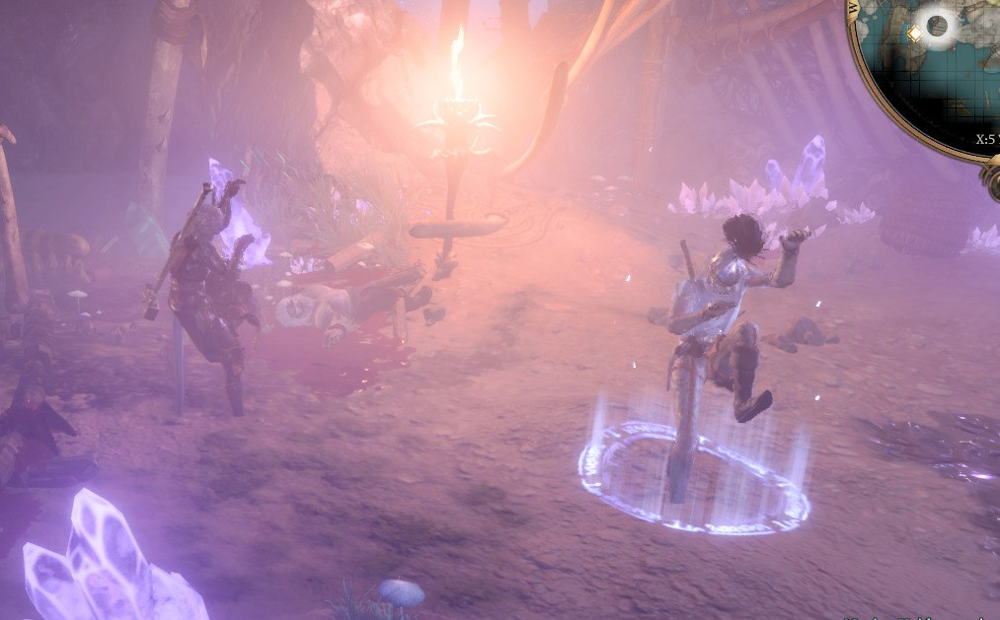

# 1. Персонаж зависает в анимации.

**Тип**: Баг

**Приоритет**: -

**Игра**: Baldur’s Gate 3

**Версия**: 4.1.1.4494476 от 20.01.2025

**OC/ Платформа**: Windows 11/ Steam

**Компонент**: Анимации/ Движение

**Краткое описание**: персонажи остаются в анимации лазания после одновременного отталкивания с лестницы 

**Описание**: если одновременно двумя персонажами взаимодействовать с лестницей и во время проигрывания анимации карабканья по ней столкнуть их каким-либо предметом - граната, притягивающее или отталкивающее заклинание. При этом оба персонажа упадут, но состояние не изменится, и они останутся в анимации карабканья. Дальнейшее взаимодействие с ними не дает результатов, оба «зависли» на одном месте и продолжают «карабкаться». Для исправления необходимо загрузить последнее сохранение.

**Шаги для воспроизведения**:
1. Зайти в игру и загрузить сохранение
2. Персонажем А взаимодействовать с лестницей
3. Персонажем Б также начать взаимодействие с лестницей 
4. Убедиться, что оба персонажа находятся на лестнице 
5. Бросить в них гранату или оттолкнуть заклинанием
6. Наблюдать за результатом

**Ожидаемый результат**: персонаж упал, анимация прекратилась, он встал и вернулся к нормальному состоянию. С ним можно продолжить взаимодействовать как обычно. 

**Фактический результат**: персонаж «зависает» в одной анимации и не реагирует на взаимодействие с ним.

