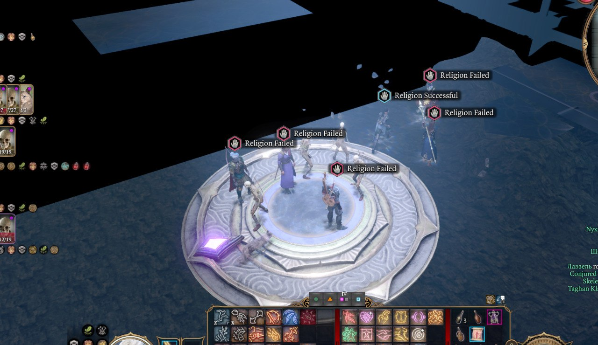

2. Исчезновение текстур уровня после кат-сцены.

**Тип**: Баг

**Приоритет**: -

**Игра**: Baldur’s Gate 3

**Версия**: 4.1.1.4763283 от 04.02.2025

**OC/ Платформа**: Windows 11/ Steam

**Компонент**: Визуальный баг/ Загрузка ассетов

**Краткое описание**: после выхода из кат-сцены пропадают текстуры окружения. 

**Описание**: в конце квеста в Храме Шар, игрокам необходимо встать на платформу-лифт. После взаимодействия с платформой и ее запуска триггерится кат-сцена. После завершения кат-сцены исчезают все текстуры окружения, остаются только текстуры-заглушки и задники. Лечится перезагрузкой сохранения. 

**Шаги для воспроизведения**:
1. Зайти в игру и загрузить сохранение
2. Всей группой встать на лифт
3. Взаимодействовать с лифтом кнопкой «Е» или нажатием на него «ЛКМ»
4. Просмотр кат-сцены и/или выбор в ней диалоговых опций
5. Завершить кат-сцену и наблюдать за результатом

**Ожидаемый результат**: после выхода из ролика группа находится на платформе и перемещаются на нижние этажи Храма дальше по заданию. 

**Фактический результат**: персонажи перемещаются дальше на платформе, но текстур самого Храма и окружения больше нет.

