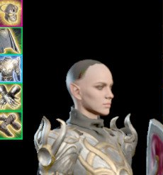

3. Исчезновение волос персонажа на модели в инвентаре.
**Тип**: Баг
**Приоритет**: -
**Игра**: Baldur’s Gate 3
**Версия**: 4.1.1.4763283 от 07.02.2025
**OC/ Платформа**: Windows 11/ Steam
**Компонент**: Визуальный баг/ Загрузка ассетов

**Краткое описание**: при надевании шлема и переключении режима его отображения у персонажа пропадают волосы на миниатюре в инвентаре. 

**Описание**: если надеть конкретно один специфичный шлем, с другими такой баг не проявлялся, и выбрать опцию «не отображать шлем в диалогах». Затем перезайти в инвентарь можно будет увидеть, что волосы на миниатюре персонажа не отображаются. Баг проявился и в кооп-лобби – у других игроков текстуры тоже не отображались. 

**Шаги для воспроизведения**:
1. Зайти в инвентарь
2. Надеть на персонажа шлем Юстициара Шар
3. Выбрать в инвентаре тип отображения шлема «не показывать в диалогах»
4. Выйти из инвентаря 
5. Зайти в инвентарь 
6. Наблюдать за результатом

**Ожидаемый результат**: миниатюра персонажа отображается корректно с полностью надетым доспехом.

**Фактический результат**: на голове у персонажа нет шлема и волос.

